<div align="center">

<h3><code>nicemon@github ~ $ ./contributions.sh</code></h3>



<br><br>

<h3><code>nicemon@github ~ $ whoami</code></h3>

<table>
<tr>
<td valign="top">

</td>
<td valign="top">

</td>
</tr>
</table>

</div>

---

## `nicemon@github ~ $ cat about.txt`

I'm **Nicemon Dominic**, a BCA developer interested in **full-stack development, AI,
cybersecurity, automation, and backend systems**.

I like taking projects from an idea into something that can actually run, ship, and be used.

```text
CONCEPT → ARCHITECTURE → CODE → DEPLOYMENT → ITERATION
```

## `nicemon@github ~ $ ls ./projects`

| Project | What it is | Stack |
|---|---|---|
| **Voddka** | Digital e-commerce platform | Node.js · Supabase · Razorpay |
| **nullEncrypt** | Encryption and steganography platform | Node.js · Cryptography |
| **Local AI Studio** | Local LLM experimentation and inference tooling | Python · GGUF · llama.cpp |
| **Network Security Monitor** | Network discovery and security monitoring experiments | Node.js · MongoDB · Nmap |
| **Hospital Management System** | Hospital workflow and administration system | Node.js · MySQL |

## `nicemon@github ~ $ cat interests.txt`

```text
[+] AI Engineering
[+] Cybersecurity
[+] Cryptography
[+] Full-Stack Development
[+] Backend Engineering
[+] Local LLMs
[+] Cloud & Deployment
[+] Developer Tools
```

## `nicemon@github ~ $ tech --list`

**Languages**

`Python` `JavaScript` `C++` `Java` `SQL`

**Web / Backend**

`Node.js` `Express` `HTML` `CSS` `REST APIs`

**Data**

`MySQL` `MongoDB` `Supabase`

**Cloud / DevOps**

`AWS` `Vercel` `Cloudflare` `Git` `GitHub`

**AI / Security**

`llama.cpp` `GGUF` `Cryptography` `Nmap` `Network Security`

## `nicemon@github ~ $ ./current-focus.sh`

```text
AI + SECURITY
     │
     ├── secure AI systems
     ├── local model infrastructure
     ├── cryptography
     ├── backend security
     └── practical developer tooling
```

## `nicemon@github ~ $ contact`

<div align="center">

[](https://github.com/nicemondominic)
[](https://www.linkedin.com/in/nicemon-dominic-931340241/)

</div>

---

<div align="center">

`build • break • learn • repeat`

</div>
